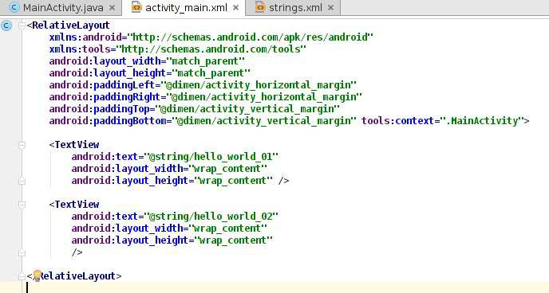
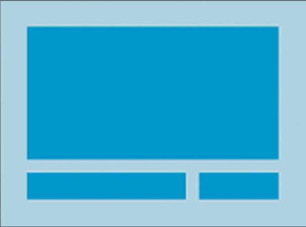
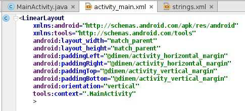
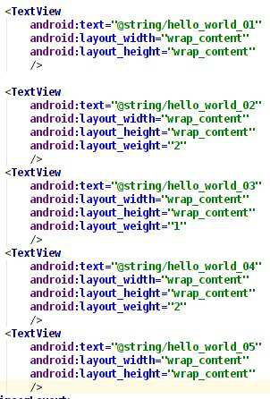
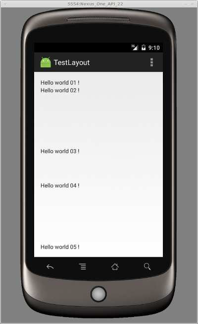

# Définir une interface graphique

**Sommaire**

* [Les layouts](#les-layouts)
    * [RelativeLayout](#relativelayout)
    * [LinearLayout](#linearlayout)
* [Les widgets](#les-widgets)
    * [Les TextView](#les-textview)
* [Implémentation d'un comportement](#implémentation-dun-comportement)
    * [Attribut android:onClick](#attribut-androidonclick)
    * [Les event listener (écouteurs)](#les-event-listener-écouteurs)

---

On peut utiliser du `XML` (façon déclarative) ou `Java` (façon programmatique) (sauf traitement de l'interaction : `Java seul`).

Il faut privilégier le XML pour la souplesse de mise à jour et la prise en compte simplifiée de différents types d'écran ainsi que pour la facilité de création des interfaces à l’aide d’un outil spécifique.

* [documentation de référence](https://developer.android.com/guide/topics/ui/index.html)

---

## Les layouts

Un `layout` est une zone invisible assurant l'organisation automatique des composants graphiques ([documentation](https://developer.android.com/guide/topics/ui/declaring-layout.html)).

Les `layouts` :
* Peuvent être déclarées en `XML` ou `Java`, mais il faut privilégier `XML` pour :
    * La séparation du code et de la mise en page
    * La souplesse d'adaptation à différents périphériques
* Possèdent des propriétés « intuitives » permettant l'organisation des composants

Il y a de nombreux layouts différents (qui peuvent être imbriqués).

De plus :
* Un layout doit être spécifié depuis `onCreate()`
    * `setContentView(R.layout.nom_du_layout)`
    * Pour la gestion multi-écrans,
        * Différentes tailles (`small`, `normal`, `large`, `xlarge`) sont possibles.
        * Différentes densités de pixels (low (`ldpi`), medium (`mdpi`), high (`hdpi`), extra high (`xhdpi`)) également.
* Il faut souvent prévoir un layout par taille (et orientation) de l'écran.
* Des effets de positionnements relatifs pouvant être gênants: prévoir des images en différentes résolutions.
* Le fonctionnement est similaire à l'internationalisation: un sous-dossier spécifique à chaque layout et/ou à chaque image

---

### RelativeLayout

Le [RelativeLayout](https://developer.android.com/guide/topics/ui/layout/relative.html) est le Layout par défaut pour un nouveau projet.

Le positionnement se fait par rapport au parent ou les uns par rapport aux autres
* `match_parent` : S'adapte à la taille du conteneur parent (dans l'exemple: l'écran)
* `wrap_content` : s'adapte à la taille de ce qu'il contient (dans l'exemple: deux zones de texte)
* ou dimension fixe

Exemple:




Le comportement par défaut est que tous les nœuds sont positionnés à partir du coin supérieur gauche. Faire attention à la superposition. 

---

### LinearLayout

Un [LinearLayout](https://developer.android.com/guide/topics/ui/layout/linear.html) aligne les noeuds dans une seule direction horizontale (par défaut) ou verticale.

Exemple:



On peut modifier le «poids » de chaque nœud, et ainsi, changer la taille de la zone occupée par chaque noeud dans l'écran. Il faut ajouter un attribut `android:layout_weight` à chaque nœud.



Pour l’alignement de chaque noeud dans sa zone, on peut ajouter un attribut `android:layout_gravity`. De nombreuses valeurs sont possibles (`center`, `center_vertical`, `center_horizontal`, `left`, `right`, `top`, `bottom` …)

---

## Les widgets

Composants graphiques visibles par l'utilisateur qui héritent de la classe [View](https://developer.android.com/reference/android/view/View.html).
* Widgets simples : zones de texte, boutons, listes, etc.
* Widgets plus complexes : horloges, barres de progression, etc.

Utilisation :
* Définition en `XML` (type, taille, centrage, position, etc.): ils peuvent également être créés dynamiquement en `Java`
* Comportement en `Java`

---

### Les TextView

Widget permettant l'affichage d'un texte normalement non éditable

Exemple:

```xml
<TextView
    android:id="@+id/text"
    android:layout_width="wrap_content"
    android:layout_height="wrap_content"
    android:text="@string/letexte"
    android:hint="texte initial"
    android:layout_gravity="center"
    android:gravity="center"
/>
```

---

## Implémentation d'un comportement


Les fichiers `XML` ne permettent que de :
* positionner les composants ;
* définir leurs caractéristiques.

Il faut donc maintenant définir leur comportement et type d'interaction (clic court, clic long, etc.).

Pour lier un composant à du code `Java`, on dispose de :
* en `XML`, de l'attribut `android:onClick`
* en `Java`, de l'instanciation d’un écouteur (`EventListener`)

---

### Attribut android:onClick

Exemple:

```xml
<!-- partie XML -->
<Button
    android:id="@+id/monBouton"
    android:layout_width="wrap_content"
    android:layout_height="wrap_content"
    android:text="@string/monTexte"
    android:onClick="onBoutonClique" (methode de la classe a appeler) 
/>
```

```java
// partie Java
public void onBoutonClique(View maVue) {
    System.out.println("le bouton avec l’id " + maVue.getid() + "a été cliqué") ;
}
```

---

### Les event listener (écouteurs)

Ce sont des interfaces prédéfinies pour les composants de la classe `View`, ne disposant que d'une seule méthode à implémenter .

Celle-ci est appelée quand le composant associé est déclenché par l'utilisateur.

Exemple : l'interface `View.onClickListener`

```java
// Java
Button button = (Button) findViewById(R.id.button_name);

button.setOnClickListener(new View.OnClickListener() {

    public void onClick(View v) {
        // Do something in response to button click
    }
});
```
On peut également implémenter directement l’interface dans la classe de l'activité.
