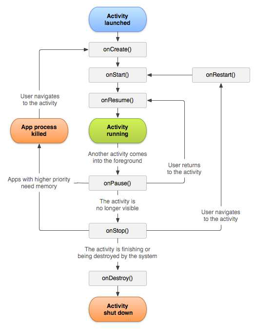
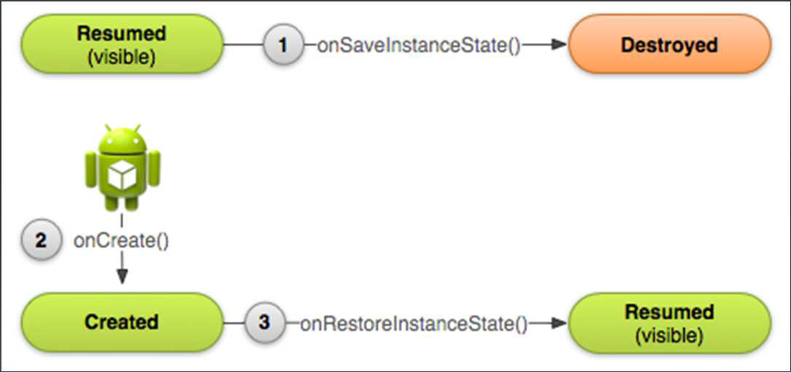

# Les activités

**Sommaire**

* [Cycle de vie d’une activité](#cycle-de-vie-dune-activité)
* [Développement Android](#développement-android)
* [L’utilisation du Bundle : sauvegarde et restauration](#lutilisation-du-bundle--sauvegarde-et-restauration)

---

## Cycle de vie d’une activité

Une activité peut se trouver dans différents états en fonction des actions du système et/ou de l'utilisateur :
* **Active** (resumed) : après un appel à `onResume()`
* **Suspendue** (paused) : après un appel à `onPause()`
* **Arrêtée** (stopped) : après un appel à `onStop()`
* **Terminée** : après un appel à onDestroy()



---

## Développement Android

Les grands principes sont:
* Une classe java par activité qui hérite de la classe [Activity](https://developer.android.com/reference/android/app/Activity.html) ;
* Les ressources associées dans le répertoire /res(layout, menu, etc.) ;
* Génération d'un code minimum par défaut sous Android Studio.

```java
public class Test extends Activity {
    @Override
    protected void onCreate(Bundle savedInstanceState) {
        super.onCreate(savedInstanceState);
        setContentView(R.layout.Bidon);
    }
}
```

D'autres méthodes peuvent être surchargées, en précisant ce qui doit être fait quand :
```java
protected void onDestroy() // l'activité se termine
protected void onStart()   // l'activité démarre (ou redémarre)
protected void onPause()   // l'activité n'est plus au premier plan
protected void onResume()  // l'activité revient au premier plan
protected void onStop()    // l'activité n'est plus visible
protected void onRestart() // l'activité redevient visible
```

---

## L’utilisation du Bundle : sauvegarde et restauration 

La classe `Bundle` permet de stocker dans des objets l'état d'une activité en vue d'une sauvegarde puis d'une restauration.

Les méthodes à surcharger sont:
```java
void onSaveInstanceState(Bundle outState)
void onCreate(Bundle savedInstanceState)
void onRestoreInstanceState(Bundle savedInstanceState)
```

