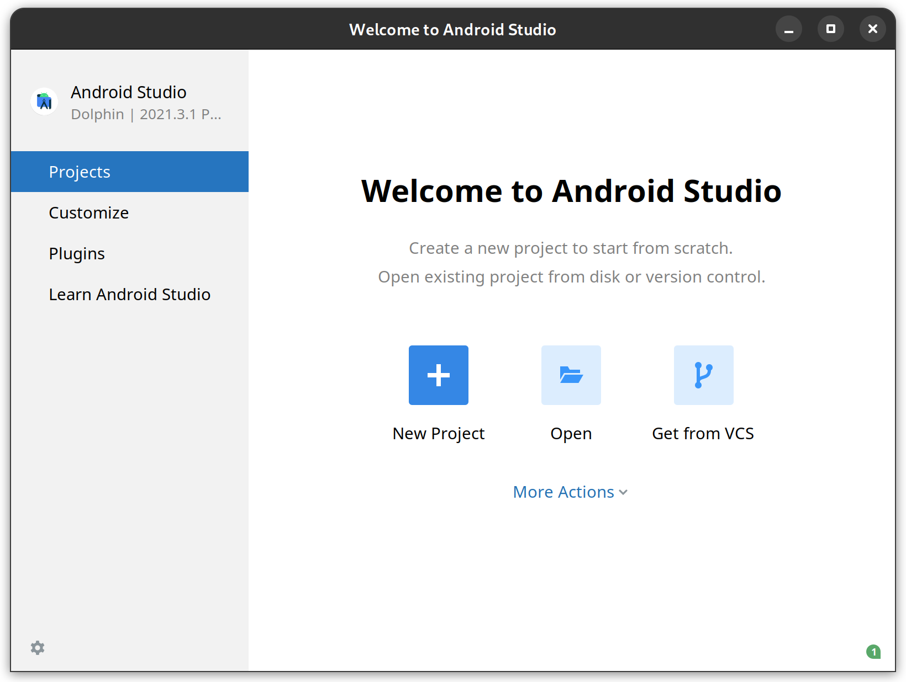
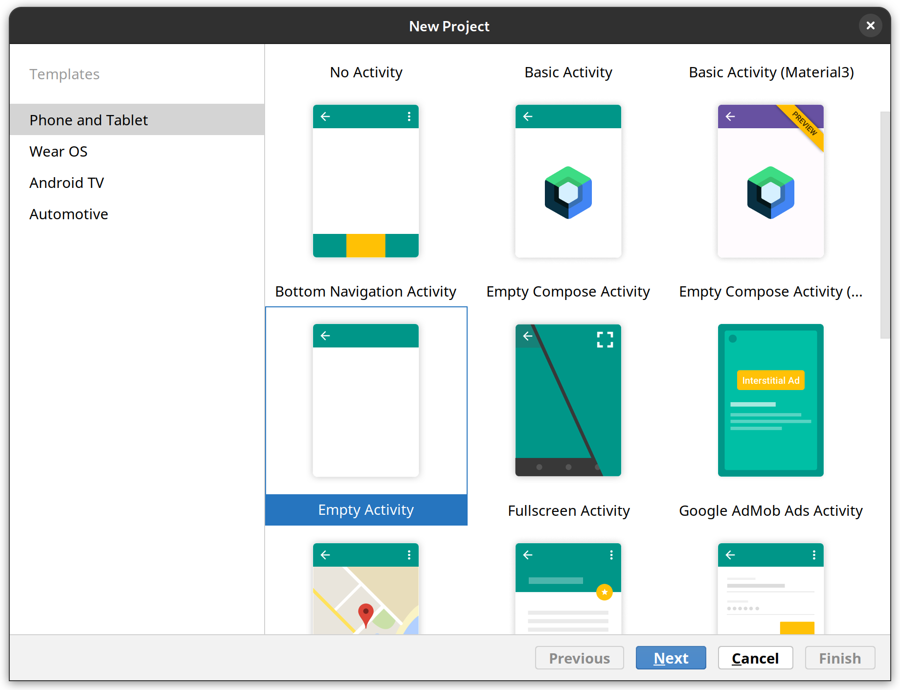
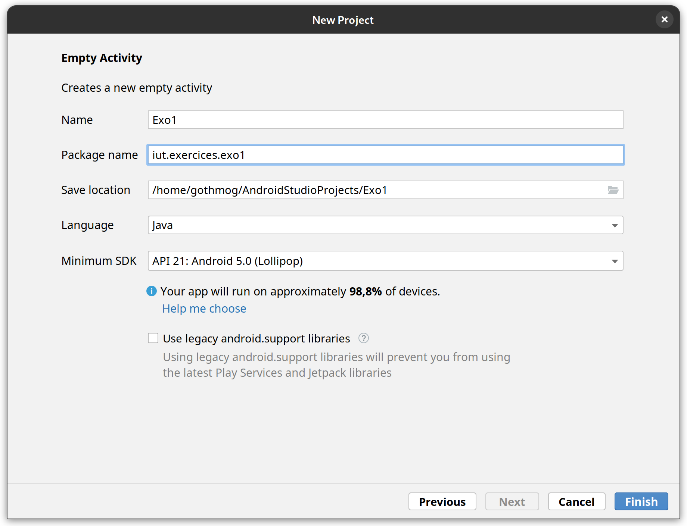
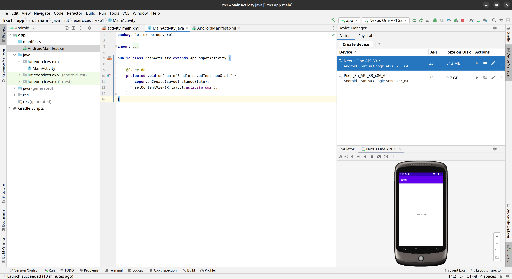
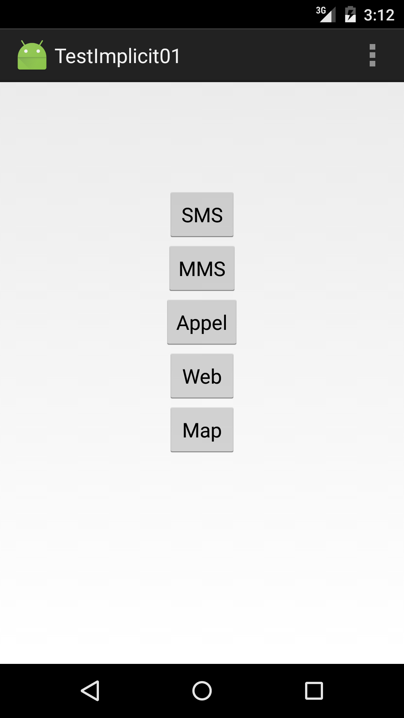

# Phase 01 : TP de découverte d'Android Studio

* *auteurs* : Stéphane Fossé, Arnaud Pêcher
* *date*: 29/11/2022

---

Ce TP est une initiation à l’environnement de développement Android Studio.

Il reprend une série d'exercices conçus par Stéphane Fossé.

---

# Déroulement

Liste des exercices:

## Bases (2h)

* [Exercice 1 : prise en main (création d’une application, compilation et lancement), refactoring](#exercice-1--prise-en-main-création-dune-application-compilation-et-lancement-refactoring)
* [Exercice 2 : strings.xml](#exercice-2--stringsxml) 
* [Exercice 3 : internationalisation](#exercice-3--internationalisation)
* [Exercice 4 : icône](#exercice-4--icône)
* [Exercice 5 : test du cycle de vie](#exercice-5--test-du-cycle-de-vie)

## Principales notions d'une application Android (4h)

* [Exercice 6 : layout et événements - projet calculatrice](#exercice-6--layout-et-événements) 
* [Exercice 7 : les intentions explicites](#exercice-7--les-intentions-explicites)
* [Exercice 8 : les intentions explicites (partie 2)](#exercice-8--les-intentions-explicites-partie-2) 
* [Exercice 9 : les intentions implicites](#exercice-9--les-intentions-implicites)
* [Exercice 10 : les intentions implicites (partie 2)](#exercice-10--les-intentions-implicites-partie-2) 
* [Exercice 11 : Les menus et images](#exercice-11--les-menus-et-images)
* [Exercice 12 : menu contextuels](#exercice-12--les-menus-et-images-partie-2) 

---

# Exercices

## Bases

---

### Exercice 1 : prise en main (création d’une application, compilation et lancement), refactoring



La première étape de la configuration consiste à sélectionner le type d’activité qui sera utilisé pour l’activité initiale de votre application. Nous utiliserons la ≪Empty Activity≫, qui correspond à un écran très simple, pour téléphones et tablettes.



L'étape suivante consiste à définir les paramètres du projet (nom, dossier), le langage du code à utiliser (`java` ou `kotlin`), ainsi que la version minimum du SDK à utiliser.

Choisir comme API minimum l’API 21 ainsi que le langage `Java`



#### Compilation et lancement de l’application

La création d’un nouveau projet via Android Studio génère une application par défaut, compilable et exécutable. 
Dans notre cas (modèle `Empty Activity`), son exécution produit la création d’une seule activité et de son écran associé, et produit l’affichage du texte Hello world! ...

**Compilation**

Pour compiler uniquement votre application, utiliser le menu `Build->Make Project` ou bien le bouton de compilation.

Vous devez voir apparaître dans la barre de notification de la fenêtre le message « Gradle build running » durant la phase de compilation, qui peut prendre quelques secondes.

**Exécution**

Pour lancer votre application, utiliser le menu `Run->Run app` ou bien le bouton de lancement. Si l’application n’a pas été compilée, une demande d’exécution lancera
préalablement la phase de compilation ...

Lancez l’exécution de cette application. Android Studio ouvre alors une fenêtre vous permettant de choisir le périphérique ou l'émulateur sur lequel doit s’exécuter l’application.

Vous disposez de deux possibilités :
* Connected Devices : si un périphérique physique (tablette, smartphone) est connecté à votre ordinateur, il apparaıt dans la partie supérieure et vous pouvez y lancer l’exécution de votre application. Dans le cas contraire, un message vous indique qu’aucun périphérique n’est connecté ;
* Available Emulators : si un émulateur a été installé, vous pouvez lancer l’exécution de l’application sur celui-ci, divers périphériques virtuels étant disponibles selon la configuration d’Android Studio dont vous disposez.

Si nécessaire, utilisez le bouton « Create New Emulator » pour créer un nouvel émulateur qui sera installé sur votre compte. Choisissez l’émulateur du NEXUS One.

Après validation du périphérique à utiliser, une console d’exécution s’ouvre dans la partie inférieure de l’IDE et après un temps plus ou moins long, l’émulateur s’ouvre.



Gardez l’émulateur ouvert (ou réduit) après l’avoir lancé.

**Réusinage (refactoring)**

Pour modifier le nom de la classe, utilisez les fonctions de refactoring disponibles dans l’IDE : `Refactor->Rename`.

Vérifiez `AndroidManifest.xml`, compilez et testez votre application.

Rétablissez ensuite le nom d'origine de la classe.

---

### Exercice 2 : strings.xml

Changer le message qui apparaît lors de l’exécution de l’application. Dans le fichier `.xml` associé à l'actvité, le message « Hello world! » apparaît dans une balise `TextView`. Vous pouvez dès lors modifier son contenu, en fonction de vos souhaits. Compilez et testez ...

Les chaînes sont normalement centralisées dans le fichier `strings.xml` et ses dérivés.

1. Créez une variable `message` dans le fichier `strings.xml`, en l’initialisant avec le texte « Coucou ! »;
2. Modifiez le `TextView` présent dans le fichier `activity_main.xml`, pour établir un lien vers cette variable. Compilez et testez.

---

### Exercice 3 : internationalisation

Vous allez à présent ≪ internationaliser ≫ votre application, en proposant 2 versions du texte qui y apparaît, l’une en anglais, l’autre en français. 

Lorsque plusieurs versions linguistiques sont présentes, ce fichier doit être dupliqué et placé dans un dossier portant le nom `values-xx`, le xx étant remplacé par un identifiant représentant la langue (`fr` pour le français, en pour l’anglais, etc.).

Plutôt que de modifier manuellement l’arborescence de l’application, Android Studio propose un éditeur permettant, d’une part de définir la traduction des données figurant dans `strings.xml` et d’autre part, de générer l’arborescence nécessaire en fonction du ou des langue(s) choisie(s).

Cliquez avec le bouton droit sur le fichier `strings.xml` et sélectionnez `Open Translations Editor`. En cliquant sur l’icône représentant la Terre (`Add Locale`), vous pouvez ajouter une nouvelle langue et saisir la traduction des entrées à votre guise. Vous devez voir apparaître dans la fenêtre de l’arborescence un nouveau fichier `strings.xml`, accompagné du drapeau de la langue choisie et de l’extension de cette langue entre parenthèses. Il ne vous reste plus qu’à compiler et tester l’application sur votre émulateur, en testant différents choix de langues sur celui-ci.

Depuis un navigateur de fichiers, vérifiez la modification dans l’arborescence des ressources (i.e. le fichier français n’est pas dans le dossier values comme laisse penser l’IDE).

---

### Exercice 4 : icône

On souhaite modifier l’icône de lancement de l’application. Dans un premier temps, récupérez une image qui servira d'icône.

Sous Android Studio, cliquez sur le bouton droit sur le dossier `app` et sélectionnez l’option `New->Image Asset`. Cela a pour effet d’ouvrir un petit éditeur qui vous permet de sélectionner une image, d’y appliquer quelques effets simples et de générer des icônes avec différents niveaux de détails. En cas de résolution insuffisante, les niveaux hauts seront plus ou moins pixélisés ...

---

### Exercice 5 : test du cycle de vie

Vous allez à présent ajouter à votre application différentes méthodes du cycle de vie de l’activité et tester leur appel.
Ajoutez un affichage dans la console lorsque la méthode `onCreate()` est appelée ; vous pouvez utiliser pour ce faire un appel à `System.out.println`. Vérifiez qu’au lancement de votre application, cet affichage est bien généré ;
Ajoutez la méthode `onStart()` suivante et de même insérez-y un affichage dans la console permettant de vérifier l’appel de cette méthode.

```java
protected void onStart() {
    super.onStart();
}
```

Compilez et testez.
Vous pouvez générer automatiquement ces fonctions en utilisant `code->override methods`.
Faites de même avec les méthodes `onStop()`, `onRestart()`, `onResume()` et `onPause()`.
Tester vos méthodes en utilisant l’émulateur.

---

## Principales notions d'une application Android

### Exercice 6 : layout et événements

Créez un nouveau projet Android « calculatrice »
Modifiez l’activité pour utiliser un layout linéaire vertical.
Réalisez l'interface graphique de la calculette « 4 opérations » directement dans le fichier XML
Associez aux boutons les actions sans implémenter pour le moment les fonctions.
Implémentez maintenant les fonctions pour finir votre application.

---

### Exercice 7 : les intentions explicites

Créez un nouveau projet Android, puis complétez celui-ci avec les étapes suivantes :
* L’activité principale dispose d'une zone de saisie et d'un bouton d'envoi. Vous testerez cette activité en faisant afficher dans la console le texte présent dans la zone de saisie lors de l'appui sur le bouton d'envoi ;
* Une nouvelle activité dans le même package avec une zone d'affichage dont le contenu initial sera le texte « en attente » (dans le fichier string.xml)

Modifiez les deux activités pour que l'activité principale, lors de l'appui sur le bouton, envoie via une intention le texte saisi à la seconde activité qui l'affichera.

---

### Exercice 8 : les intentions explicites (partie 2)

Créez un nouveau projet composé de 3 activités :
* L’activité principale présente à l'utilisateur deux parties contenant respectivement :
    * Pour la partie supérieure, des champs correspondant à un nom, un prénom et un numéro de téléphone, ainsi qu'un bouton Modifier ;
    * Pour la partie inférieure, une adresse sous la forme des champs numéro, nom de rue, code postal et ville, ainsi qu'un bouton Modifier.
* Une seconde activité, déclenchée par appui du bouton Modifier de la partie supérieure, permettant à l'utilisateur de modifier la valeur des différents champs concernant son identité. Deux boutons seront présents, l'un permettant de valider les modifications saisies (renvoyées à l'activité principale) et l'autre permettant d'annuler ces modifications et de revenir à l'activité principale ;
* Une troisième activité, fonctionnant de manière similaire, sur les informations concernant l'adresse de l'utilisateur.

---

### Exercice 9 : les intentions implicites

Créez un nouveau projet et créer l’IHM ci-dessous.



Complétez votre activité principale de telle sorte que l’appui sur chacun d’un de ces boutons provoque l’affichage du texte du bouton dans la console ( une seule fonction ).

Modifiez le code de gestion de l’appui sur le bouton SMS de telle sorte que cet événement déclenche une intention visant l’envoi d’un sms.

L’action à utiliser est `ACTION SENDTO` et l’URI à créer doit utiliser le schéma sms et une information correspondant à un numéro de téléphone quelconque. Testez cette fonctionnalité ;

Faites de même pour le bouton MMS et pour le bouton appel;

Complétez le code de gestion du bouton web, de manière à ouvrir une page web.

Faite de même pour le bouton `map` avec `geo:0,0?q=1600+Amphitheatre+Parkway,+Mountain+View,+CA+94043`

---

### Exercice 10 : les intentions implicites (partie 2)

Modifiez votre application de telle sorte qu’elle comporte :
* un champ de saisie permettant de récupérer le numéro de téléphone à utiliser pour les sms, mms et appels ;
* Un champ de saisie pour l’url à ouvrir ;
* Deux champs de saisie pour les coordonnées géographiques (lattitude et longitude) d’un lieu à visualiser.

Testez votre application.

---

### Exercice 11 : Les menus et images

L'objectif de cet exercice est d’écrire une application permettant de charger une image stockée sur le périphérique et de l'afficher.

L’interface sera simplement constituée d’un bouton (pour permettre le chargement) et de l’image.

Dans un premier temps, créez l’interface graphique. Le widget à utiliser pour l’image est `ImageView`.

Compléter le code de l’application pour gérer l’appui sur le bouton de chargement, en faisant afficher un message dans la console.

Complétez l’application pour qu’elle émette une intention dont l’action sera `ACTION GET CONTENT` et le type celui correspondant à une image, qu’elle récupère l’image retournée et l’affiche dans le widget correspondant.
* La classe à utiliser pour l’image est `ImageView` ;
* Pour pouvoir charger une image, votre application doit sans doute disposer d’une permission

Lorsque le chargement de vos images fonctionne, ajoutez des boutons à votre application, permettant d’effectuer
* Un miroir horizontal de l’image
* Un miroir vertical de l’image

---

### Exercice 12 : Les menus et images (partie 2)

Modifiez votre application de chargement d’images en lui ajoutant un menu qui reprenne les deux opérations de miroirs horizontal et vertical. Lorsque ce menu sera opérationnel, vous supprimerez les deux boutons de l’interface.

Ajoutez un menu contextuel au composant d’affichage de l’image, pour que les deux opérations suivantes puissent être appliquées à l’image :
* Inverser les couleurs de l’image ;
* Transformer l’image en niveaux de gris

---
